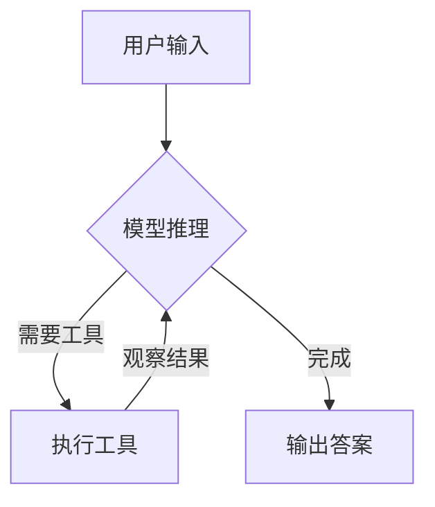

# CrewAI 和 LangChain 框架文档调研

> 📚 **Edu·伴学堂** 整理  
> 目标用户：有 C++/Go 经验的开发者，正在搭建 Multi-Agent 系统  
> 最后更新：2026-03-09

---

## 目录

1. [CrewAI 核心概念](#1-crewai-核心概念)
2. [CrewAI 快速入门](#2-crewai-快速入门)
3. [LangChain 核心概念](#3-langchain-核心概念)
4. [LangChain 快速入门](#4-langchain-快速入门)
5. [框架对比与选择建议](#5-框架对比与选择建议)
6. [离线开发指南](#6-离线开发指南) 🔥
7. [学习资源链接](#7-学习资源链接)

---

## 1. CrewAI 核心概念

CrewAI 是一个专注于**多 Agent 协作**的框架，让你能够像组建团队一样编排 AI Agent。

### 1.1 核心组件

#### Agent（智能体）
Agent 是 CrewAI 中的基本执行单元，类似于团队中的成员。

**核心属性：**
| 属性 | 参数 | 类型 | 说明 |
|------|------|------|------|
| Role | `role` | str | 定义 Agent 的职责和专业领域 |
| Goal | `goal` | str | 指导 Agent 决策的个体目标 |
| Backstory | `backstory` | str | 提供背景和个性，丰富交互 |
| LLM | `llm` | Union[str, LLM] | 驱动 Agent 的语言模型 |
| Tools | `tools` | List[BaseTool] | Agent 可用的工具/能力 |
| Verbose | `verbose` | bool | 启用详细执行日志 |
| Allow Delegation | `allow_delegation` | bool | 允许 Agent 委托任务给其他 Agent |
| Memory | `memory` | bool | 保持对话历史 |
| Max Iterations | `max_iter` | int | 最大迭代次数（默认 20） |

**示例：**
```python
from crewai import Agent
from crewai_tools import SerperDevTool

researcher = Agent(
    role="高级数据研究员",
    goal="发现{topic}领域的前沿发展",
    backstory="你是一位经验丰富的研究员，擅长发现最新发展趋势",
    tools=[SerperDevTool()],
    verbose=True,
    allow_delegation=False
)
```

#### Task（任务）
Task 是分配给 Agent 的具体工作单元。

**核心属性：**
| 属性 | 参数 | 类型 | 说明 |
|------|------|------|------|
| Description | `description` | str | 任务的清晰描述 |
| Expected Output | `expected_output` | str | 任务完成的标准描述 |
| Agent | `agent` | BaseAgent | 负责执行的 Agent |
| Tools | `tools` | List[BaseTool] | 任务可用的工具 |
| Context | `context` | List[Task] | 依赖的其他任务输出 |
| Output File | `output_file` | str | 输出文件路径 |
| Markdown | `markdown` | bool | 是否使用 Markdown 格式输出 |

**示例：**
```python
from crewai import Task

research_task = Task(
    description="对{topic}进行彻底调研，确保找到所有相关信息",
    expected_output="包含 10 个要点的列表，涵盖{topic}最重要的信息",
    agent=researcher,
    output_file="research_report.md",
    markdown=True
)
```

#### Crew（团队）
Crew 是 Agent 和 Task 的集合，定义了协作流程。

**执行流程类型：**
- **Sequential（顺序）**：任务按定义顺序依次执行
- **Hierarchical（层级）**：根据 Agent 角色和专长分配任务

**示例：**
```python
from crewai import Crew, Process

crew = Crew(
    agents=[researcher, analyst],
    tasks=[research_task, analysis_task],
    process=Process.sequential,
    verbose=True
)

result = crew.kickoff(inputs={"topic": "AI Agents"})
```

#### Process（流程）
流程定义了 Crew 如何协调 Agent 和 Task 的执行。

### 1.2 项目结构（推荐）

CrewAI 推荐使用 YAML 配置 + Python 代码的混合方式：

```
my_crew/
├── src/
│   └── my_crew/
│       ├── __init__.py
│       ├── main.py           # 入口文件
│       ├── crew.py           # Crew 定义
│       └── config/
│           ├── agents.yaml   # Agent 配置
│           └── tasks.yaml    # Task 配置
├── pyproject.toml
└── .env
```

**agents.yaml 示例：**
```yaml
researcher:
  role: >
    {topic} 高级数据研究员
  goal: >
    发现{topic}领域的前沿发展
  backstory: >
    你是一位经验丰富的研究员，擅长发现最新发展趋势

analyst:
  role: >
    {topic} 报告分析师
  goal: >
    基于{topic}数据分析创建详细报告
  backstory: >
    你是一位细致的分析师，擅长将复杂数据转化为清晰报告
```

**tasks.yaml 示例：**
```yaml
research_task:
  description: >
    对{topic}进行彻底调研
  expected_output: >
    包含 10 个要点的列表
  agent: researcher

reporting_task:
  description: >
    基于调研结果扩展每个主题为完整章节
  expected_output: >
    完整的 Markdown 格式报告
  agent: analyst
  output_file: report.md
  markdown: true
```

---

## 2. CrewAI 快速入门

### 2.1 安装（2026 年 3 月更新）

#### 环境要求

| 组件 | 版本要求 | 推荐 |
|------|---------|------|
| **Python** | **>=3.10, <3.14** | **3.11 或 3.12** |
| pip | >=21.0 | 24.0+ |

```bash
# 检查 Python 版本
python --version  # 必须 3.10-3.13
```

#### 安装命令

```bash
# ✅ 官方推荐方式（包含 tools）
pip install "crewai[tools]"

# 或使用 uv（更快）
uv add "crewai[tools]"

# 或只安装核心包（不含 tools）
pip install crewai
```

### 2.2 创建项目

```bash
# 使用 CLI 创建新项目
crewai create crew my-first-crew
cd my_first_crew
```

### 2.3 5 分钟上手示例

**步骤 1：配置环境变量**
```bash
# .env 文件
OPENAI_API_KEY=your-api-key
SERPER_API_KEY=your-serper-key  # 用于搜索工具
```

**步骤 2：修改 agents.yaml**
```yaml
# src/my_first_crew/config/agents.yaml
researcher:
  role: >
    AI 技术研究员
  goal: >
    发现 AI 领域的最新突破
  backstory: >
    你是一位专注 AI 技术的研究员，擅长从海量信息中筛选关键内容

writer:
  role: >
    技术内容作家
  goal: >
    将技术内容转化为易懂的文章
  backstory: >
    你是一位经验丰富的技术作家，擅长用通俗语言解释复杂概念
```

**步骤 3：修改 tasks.yaml**
```yaml
# src/my_first_crew/config/tasks.yaml
research_task:
  description: >
    调研最新的 AI 技术突破，关注 2025 年的重要进展
  expected_output: >
    包含 5 个最重要突破的列表，每个突破附带简短说明
  agent: researcher

writing_task:
  description: >
    基于调研结果，撰写一篇技术博客文章
  expected_output: >
    一篇完整的 Markdown 格式博客文章
  agent: writer
  output_file: blog_post.md
  markdown: true
```

**步骤 4：运行 Crew**
```bash
# 在 main.py 中传入输入参数
crew.kickoff(inputs={"topic": "AI Agents"})
```

**步骤 5：执行**
```bash
crewai run
```

### 2.4 关键 API 参考

| API | 说明 | 示例 |
|-----|------|------|
| `Agent()` | 创建 Agent | `Agent(role="...", goal="...", tools=[...])` |
| `Task()` | 创建 Task | `Task(description="...", agent=..., output_file="...")` |
| `Crew()` | 创建 Crew | `Crew(agents=[...], tasks=[...], process=Process.sequential)` |
| `crew.kickoff()` | 启动执行 | `crew.kickoff(inputs={"key": "value"})` |
| `@CrewBase` | 装饰器定义 Crew | `@CrewBase class MyCrew(): ...` |
| `@agent` | 装饰器定义 Agent | `@agent def researcher(self) -> Agent: ...` |
| `@task` | 装饰器定义 Task | `@task def research_task(self) -> Task: ...` |

---

## 3. LangChain 核心概念

LangChain 是一个用于构建 LLM 应用的框架，提供**标准化的模型接口**和**灵活的 Agent 架构**。

### 3.1 核心组件

#### LLM / Chat Model（语言模型）
LangChain 统一了不同模型提供商的接口。

**初始化方式：**
```python
from langchain.chat_models import init_chat_model

# 使用模型标识符（推荐）
model = init_chat_model("anthropic:claude-sonnet-4-6")

# 或直接使用提供商类
from langchain_openai import ChatOpenAI
model = ChatOpenAI(model="gpt-4o", temperature=0.7, max_tokens=1000)
```

**支持的提供商：** OpenAI、Anthropic、Google、Azure、Ollama 等

#### Tool（工具）
工具是 Agent 可以调用的函数。

**定义方式：**
```python
from langchain.tools import tool

@tool
def get_weather(city: str) -> str:
    """获取指定城市的天气信息"""
    return f"{city}的天气：晴朗，25°C"

@tool
def search(query: str) -> str:
    """搜索信息"""
    return f"搜索结果：{query}"
```

**带运行时上下文的工具：**
```python
from dataclasses import dataclass
from langchain.tools import tool, ToolRuntime

@dataclass
class Context:
    user_id: str

@tool
def get_user_location(runtime: ToolRuntime[Context]) -> str:
    """获取用户位置"""
    user_id = runtime.context.user_id
    return "Beijing" if user_id == "1" else "Shanghai"
```

#### Agent（智能体）
Agent 结合 LLM 和工具，能够自主推理和执行任务。

**创建方式：**
```python
from langchain.agents import create_agent

agent = create_agent(
    model="anthropic:claude-sonnet-4-6",
    tools=[get_weather, search],
    system_prompt="你是一个有帮助的助手"
)

# 运行 Agent
response = agent.invoke({
    "messages": [{"role": "user", "content": "北京天气怎么样？"}]
})
```

#### Chain（链）
Chain 将多个组件组合成完整的工作流。

**简单示例：**
```python
from langchain.prompts import ChatPromptTemplate
from langchain.chat_models import init_chat_model

# 定义提示模板
prompt = ChatPromptTemplate.from_messages([
    ("system", "你是一个{profession}专家"),
    ("user", "{input}")
])

# 创建链
model = init_chat_model("anthropic:claude-sonnet-4-6")
chain = prompt | model

# 执行
response = chain.invoke({"profession": "Python", "input": "如何学习？"})
```

#### Memory（记忆）
记忆让 Agent 能够记住之前的对话。

```python
from langgraph.checkpoint.memory import InMemorySaver

# 创建检查点（记忆存储）
checkpointer = InMemorySaver()

# 创建带记忆的 Agent
agent = create_agent(
    model="anthropic:claude-sonnet-4-6",
    tools=[get_weather],
    checkpointer=checkpointer
)

# 使用 thread_id 保持对话状态
config = {"configurable": {"thread_id": "conversation-1"}}

# 第一轮对话
agent.invoke({"messages": [{"role": "user", "content": "你好"}]}, config=config)

# 第二轮对话（Agent 记得之前的内容）
agent.invoke({"messages": [{"role": "user", "content": "继续刚才的话题"}]}, config=config)
```

### 3.2 ReAct 模式

LangChain Agent 遵循 **ReAct（Reasoning + Acting）**模式：

```
用户输入 → LLM 推理 → 选择工具 → 执行工具 → 观察结果 → 继续推理 → ... → 最终答案
```

**执行流程：**


---

## 4. LangChain 快速入门

### 4.1 安装

```bash
# 基础安装
pip install langchain

# 安装特定提供商
pip install langchain-anthropic  # Anthropic
pip install langchain-openai     # OpenAI
pip install langchain-google-genai  # Google

# 或使用 extras
pip install "langchain[anthropic]"
```

### 4.2 10 分钟上手示例

**步骤 1：设置环境变量**
```bash
export ANTHROPIC_API_KEY=your-api-key
```

**步骤 2：创建基础 Agent**
```python
from langchain.agents import create_agent

# 定义工具
def get_weather(city: str) -> str:
    """获取城市天气"""
    return f"{city}总是阳光明媚！"

# 创建 Agent
agent = create_agent(
    model="anthropic:claude-sonnet-4-6",
    tools=[get_weather],
    system_prompt="你是一个有帮助的天气助手"
)

# 运行
response = agent.invoke({
    "messages": [{"role": "user", "content": "上海天气怎么样？"}]
})
print(response)
```

**步骤 3：创建完整的生产级 Agent**

```python
from dataclasses import dataclass
from langchain.agents import create_agent
from langchain.chat_models import init_chat_model
from langchain.tools import tool, ToolRuntime
from langgraph.checkpoint.memory import InMemorySaver
from langchain.agents.structured_output import ToolStrategy

# 1. 定义系统提示
SYSTEM_PROMPT = """你是一个专业的天气预报员，喜欢用双关语说话。

你可以使用以下工具：
- get_weather_for_location: 获取指定地点的天气
- get_user_location: 获取用户位置

如果用户询问天气，确保你知道位置。如果可以判断用户指的是当前位置，使用 get_user_location 工具。"""

# 2. 定义上下文 Schema
@dataclass
class Context:
    user_id: str

# 3. 定义工具
@tool
def get_weather_for_location(city: str) -> str:
    """获取指定地点的天气"""
    return f"{city}的天气：晴朗，25°C"

@tool
def get_user_location(runtime: ToolRuntime[Context]) -> str:
    """获取用户位置"""
    user_id = runtime.context.user_id
    return "北京" if user_id == "1" else "上海"

# 4. 配置模型
model = init_chat_model(
    "anthropic:claude-sonnet-4-6",
    temperature=0.5,
    timeout=10,
    max_tokens=1000
)

# 5. 定义响应格式（结构化输出）
@dataclass
class ResponseFormat:
    """响应 Schema"""
    punny_response: str  # 有趣的双关语回答
    weather_conditions: str | None = None  # 天气详情

# 6. 设置记忆
checkpointer = InMemorySaver()

# 7. 创建 Agent
agent = create_agent(
    model=model,
    system_prompt=SYSTEM_PROMPT,
    tools=[get_user_location, get_weather_for_location],
    context_schema=Context,
    response_format=ToolStrategy(ResponseFormat),
    checkpointer=checkpointer
)

# 8. 运行 Agent
config = {"configurable": {"thread_id": "1"}}

response = agent.invoke(
    {"messages": [{"role": "user", "content": "外面天气怎么样？"}]},
    config=config,
    context=Context(user_id="1")
)

print(response['structured_response'])
```

### 4.3 关键 API 参考

| API | 说明 | 示例 |
|-----|------|------|
| `init_chat_model()` | 初始化聊天模型 | `init_chat_model("anthropic:claude-sonnet-4-6")` |
| `@tool` | 装饰器定义工具 | `@tool def my_tool(arg: str) -> str: ...` |
| `create_agent()` | 创建 Agent | `create_agent(model="...", tools=[...])` |
| `agent.invoke()` | 运行 Agent | `agent.invoke({"messages": [...]})` |
| `InMemorySaver()` | 内存检查点 | `checkpointer = InMemorySaver()` |
| `ToolStrategy()` | 结构化输出策略 | `response_format=ToolStrategy(MySchema)` |
| `|` (管道) | 组合 Chain | `chain = prompt | model | output_parser` |

---

## 5. 框架对比与选择建议

### 5.1 核心差异

| 维度 | CrewAI | LangChain |
|------|--------|-----------|
| **定位** | 多 Agent 协作编排 | LLM 应用开发框架 |
| **核心抽象** | Agent → Task → Crew | LLM → Tool → Agent → Chain |
| **多 Agent** | 原生支持，核心特性 | 通过 LangGraph 实现 |
| **配置方式** | YAML + Python | 纯 Python |
| **学习曲线** | 较低，约定优于配置 | 较陡，灵活但复杂 |
| **适用场景** | 团队协作型任务 | 通用 LLM 应用 |
| **记忆支持** | 内置 | 通过 LangGraph Checkpointer |
| **工具生态** | CrewAI Tools + LangChain Tools | 丰富的集成生态 |

### 5.2 选择建议

**选择 CrewAI 如果：**
- ✅ 需要快速搭建多 Agent 协作系统
- ✅ 喜欢约定优于配置的方式
- ✅ 需要 YAML 配置管理 Agent/Task
- ✅ 关注团队协作模式（Researcher → Writer → Reviewer）

**选择 LangChain 如果：**
- ✅ 需要最大的灵活性和控制力
- ✅ 构建复杂的 LLM 应用（RAG、对话系统等）
- ✅ 需要丰富的工具集成生态
- ✅ 需要精细控制执行流程

**混合使用（推荐）：**
- 使用 LangChain 的 Tool 和 LLM 集成
- 使用 CrewAI 的多 Agent 编排
- 两者工具生态兼容

### 5.3 针对你的场景（C++/Go 背景）

**建议学习路径：**

1. **先学 CrewAI**（1-2 天）
   - 概念简单，类似"定义类 → 创建对象 → 调用方法"
   - YAML 配置类似 Go 的 struct tags
   - 快速看到多 Agent 协作效果

2. **再学 LangChain**（3-5 天）
   - 理解 Chain 的管道组合（类似函数式编程）
   - 掌握 Tool 和 Agent 的底层机制
   - 学习 LangGraph 进行高级编排

3. **结合使用**
   - 用 CrewAI 编排多 Agent 流程
   - 用 LangChain 提供工具和模型集成

---

## 6. 学习资源链接

### CrewAI

| 资源 | 链接 | 说明 |
|------|------|------|
| 官方文档 | https://docs.crewai.com | 完整 API 文档 |
| GitHub | https://github.com/crewAIInc/crewAI | 源码和示例 |
| 社区 | https://community.crewai.com | 问答和分享 |
| 示例集 | https://docs.crewai.com/en/examples/cookbooks | 实战示例 |

### LangChain

| 资源 | 链接 | 说明 |
|------|------|------|
| 官方文档 | https://python.langchain.com | 完整 API 文档 |
| GitHub | https://github.com/langchain-ai/langchain | 源码 |
| LangSmith | https://smith.langchain.com | 调试和监控 |
| 集成列表 | https://python.langchain.com/docs/integrations/providers | 支持的提供商 |

### 综合资源

| 资源 | 链接 | 说明 |
|------|------|------|
| LangChain 中文教程 | https://liaokong.gitbook.io/llm-kai-fa-jiao-cheng | 社区翻译 |
| Awesome LangChain | https://github.com/kyrolabs/awesome-langchain | 资源集合 |

---

## 附录：完整示例代码

### CrewAI 完整示例

```python
# src/my_crew/crew.py
from crewai import Agent, Crew, Process, Task
from crewai.project import CrewBase, agent, crew, task
from crewai_tools import SerperDevTool

@CrewBase
class ResearchCrew():
    """研究团队"""

    agents_config = "config/agents.yaml"
    tasks_config = "config/tasks.yaml"

    @agent
    def researcher(self) -> Agent:
        return Agent(
            config=self.agents_config['researcher'],
            verbose=True,
            tools=[SerperDevTool()]
        )

    @agent
    def writer(self) -> Agent:
        return Agent(
            config=self.agents_config['writer'],
            verbose=True
        )

    @task
    def research_task(self) -> Task:
        return Task(config=self.tasks_config['research_task'])

    @task
    def writing_task(self) -> Task:
        return Task(
            config=self.tasks_config['writing_task'],
            output_file='output/blog_post.md'
        )

    @crew
    def crew(self) -> Crew:
        return Crew(
            agents=self.agents,
            tasks=self.tasks,
            process=Process.sequential,
            verbose=True
        )

# src/my_crew/main.py
#!/usr/bin/env python
from my_crew.crew import ResearchCrew

def run():
    inputs = {'topic': 'AI Agents'}
    ResearchCrew().crew().kickoff(inputs=inputs)

if __name__ == "__main__":
    run()
```

### LangChain 完整示例

```python
from dataclasses import dataclass
from langchain.agents import create_agent
from langchain.chat_models import init_chat_model
from langchain.tools import tool, ToolRuntime
from langgraph.checkpoint.memory import InMemorySaver

# 定义上下文
@dataclass
class Context:
    user_id: str

# 定义工具
@tool
def get_weather(city: str) -> str:
    """获取天气"""
    return f"{city}: 晴朗，25°C"

@tool
def get_user_location(runtime: ToolRuntime[Context]) -> str:
    """获取用户位置"""
    return "北京" if runtime.context.user_id == "1" else "上海"

# 创建 Agent
model = init_chat_model("anthropic:claude-sonnet-4-6")
checkpointer = InMemorySaver()

agent = create_agent(
    model=model,
    system_prompt="你是一个有帮助的天气助手",
    tools=[get_weather, get_user_location],
    context_schema=Context,
    checkpointer=checkpointer
)

# 运行
config = {"configurable": {"thread_id": "1"}}
response = agent.invoke(
    {"messages": [{"role": "user", "content": "我这边天气怎么样？"}]},
    config=config,
    context=Context(user_id="1")
)

print(response)
```

---

---

## 6. 离线开发指南 🔥

> 💡 **新增**: 针对网络受限环境的离线开发方案

### 快速链接

- **[离线开发完整指南](./offline-development-guide.md)** - 包含 3 种离线安装方案

### 核心内容

| 方案 | 适用场景 | 难度 |
|------|---------|------|
| 方案一：有网环境下载依赖包 | 可以临时联网 | ⭐ |
| 方案二：本地镜像源 | 多台机器离线开发 | ⭐⭐⭐ |
| 方案三：手动下载离线包 | 完全离线 | ⭐⭐ |

### 快速命令参考

```bash
# 方案一：下载离线包
pip download -r requirements.txt -d packages/

# 方案二：使用本地源
pip install --no-index --find-links=packages/ -r requirements.txt

# 验证安装
python -c "import crewai; print(crewai.__version__)"
```

---

## 7. 学习资源链接

### CrewAI 官方资源
- **GitHub**: https://github.com/joaomdmoura/crewAI
- **文档**: https://docs.crewai.com
- **PyPI**: https://pypi.org/project/crewai

### LangChain 官方资源
- **GitHub**: https://github.com/langchain-ai/langchain
- **文档**: https://python.langchain.com
- **PyPI**: https://pypi.org/project/langchain

---

**下一步**：将此文档交给 **Dev·技术匠 🔧**，开始编写可运行的 Demo 代码。
